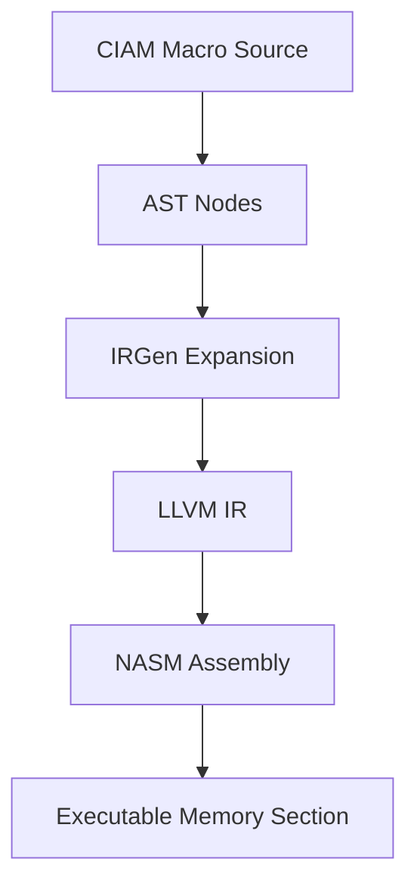
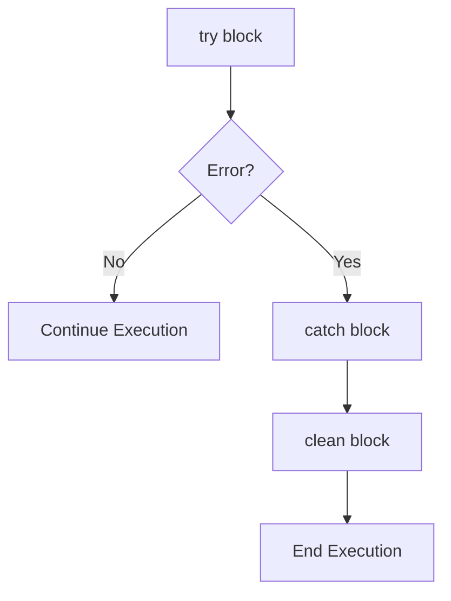
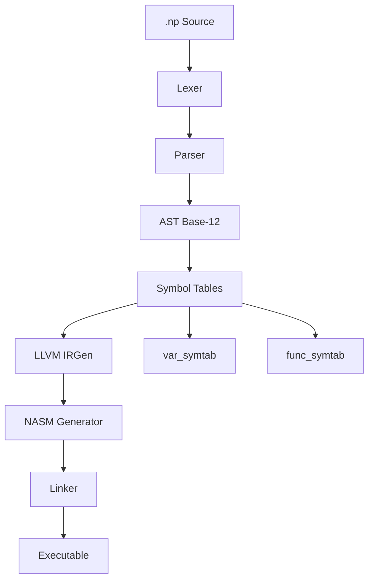

# 📂 `docs/internals_diagrams.md`

```markdown
# 🖼️ NeoPaquet Internal Diagrams

This document contains **visual diagrams** (ASCII + Mermaid) to illustrate internals of the NeoPaquet compiler:
- Symbol Table Flow
- CIAM Macro Expansion
- Error Handling Execution Flow

---

## 1. Symbol Table Flow

### ASCII
```

+---------------------+
\|  Source (.np)       |
+---------------------+
|
v
+---------------------+
\|  Parser             |
\|  (builds AST)       |
+---------------------+
|
v
+---------------------+

| Symbol Table            |
| ----------------------- |
| var\_symtab: dict       |
| - x -> LLVM Value       |
| - y -> Constant         |
|                         |
| func\_symtab: dict      |
| - square -> Func        |
| - fib -> Func           |
| +---------------------+ |

```
      |
      v
```

+---------------------+
\|  IR Generator       |
+---------------------+

````

### Mermaid
```mermaid
flowchart TD
    A[Parser] --> B[AST]
    B --> C[Symbol Tables]
    C --> D[IR Generator]
    C -->|var_symtab| V1[Variables]
    C -->|func_symtab| V2[Functions]
````

---

## 2. CIAM Macro Expansion

### ASCII

```
Source:
mem.arena { size=1024 }
mem.slice { start=0, len=12 }

AST:
ArenaDecl(size=1024)
SliceDecl(start=0, len=12)

IRGen:
%arena = alloca [1024 x i8]

NASM:
section .bss
arena resb 1024
```

### Mermaid



---

## 3. Error Handling Flow

### ASCII

```
Source:
try { x = 10 / 0 }
catch { print ["error"] }
clean { print ["cleanup"] }

Execution Flow:
+---------+
|  try    |
+---------+
     |
     v
+------------------+
| normal execution |
+------------------+
     |
     +--------------------> error? yes
     |                    v
     |             +------------+
     |             |   catch    |
     |             +------------+
     |                    |
     |                    v
     |             +------------+
     |             |   clean    |
     |             +------------+
     |                    |
     v                    v
  continue             terminate
```

### Mermaid



---

## 4. Overview: Compiler Internals

### Mermaid (full)



---

## 5. Key Takeaways

* **Symbol Tables** → Variables + Functions are tracked separately.
* **CIAM Expansion** → Memory macros lower into safe allocators.
* **Error Flow** → `try/catch/clean` lowers into structured control flow in LLVM + NASM.

```

---

## ✅ What This Adds
- Contributor-facing **visualization of internals**.  
- **Symbol table lifecycle** from parser → IR.  
- **Macro expansion** shown in source → AST → IR → NASM.  
- **Error handling flow** in both ASCII + Mermaid.  
- A **full compiler overview diagram** tying it all together.  

---

⚡
